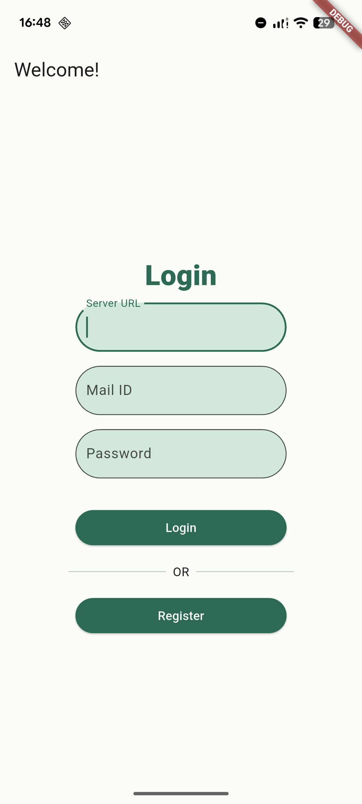
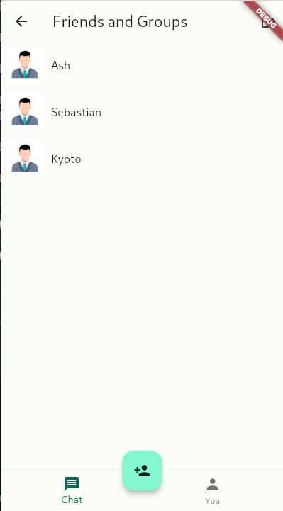
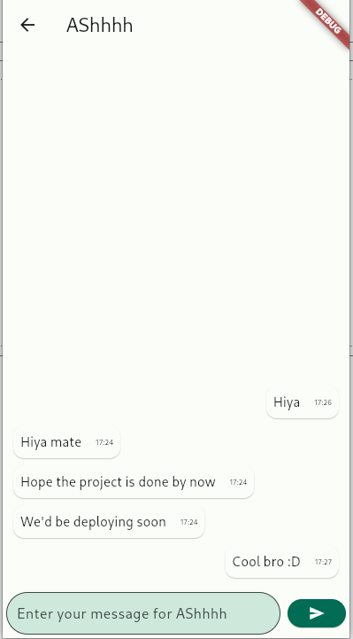

# C-Hat Client

Cross-platform client for the c-hat chatting service. Say no to centralized chats, hello to decentralized servers! The client allows you to login to JUST 1 server of your choice, with unique credentials, leaving no trace of connections between various servers.

## Tech Stack
- Flutter/Dart
- Backend: [C-Hat Server V2](https://github.com/justincodinguk/c-hat-server-v2)
- BLoC architecture with repository pattern
- Websocket clients
- Custom code generators for data classes
- Custom library for platform-specific UI 
- Floor DB for SQLite ORM
- Custom Auth system with email verification handled by the backend.